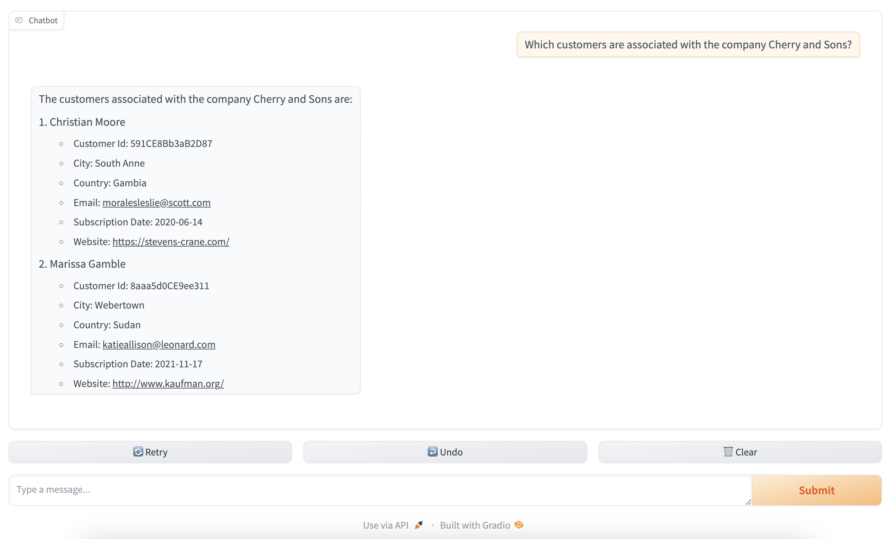
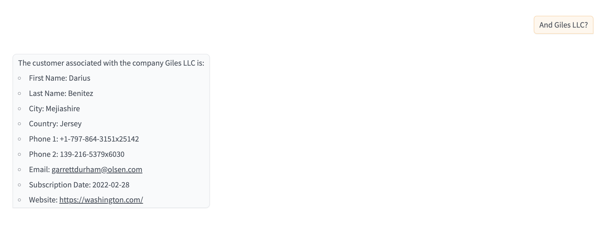
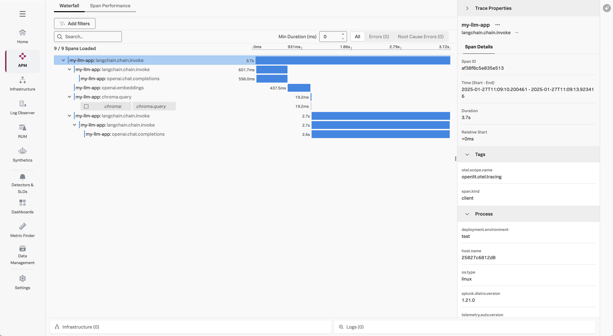

# v6:  Adding a UI 

This version of the application builds on v4 that uses Chroma DB and OpenAI, and 
adds a user interface for prompts rather than requiring .json file input. 

## Prerequisites

* Python 3.9+
* [Splunk Distribution of the OpenTelemetry Collector](https://docs.splunk.com/observability/en/gdi/opentelemetry/opentelemetry.html#otel-intro-install) 
* An OpenAI account (set via the `OPENAI_API_KEY` environment variable) that has access to utilize the API

## Run the Application

Execute the following commands to run the application: 

````
# clone the repo if you haven't already
git clone https://github.com/dmitchsplunk/langchain-with-splunk.git

# navigate to the directory repo
cd langchain-with-splunk/v6

# create a virtual environment 
python3 -m venv openai-env

# activate the virtual environment
source openai-env/bin/activate

# install the required packages
pip3 install -r ./requirements.txt

# define the service name and environment
export OTEL_SERVICE_NAME=my-llm-app
export OTEL_RESOURCE_ATTRIBUTES='deployment.environment=test'

# load the customer data into Chroma DB 
# Note:  Running the customer_data.py program multiple times will result in 
# duplicate embeddings stored in the vector database. If needed, you can 
# delete the my_embeddings folder and run this program once to start fresh.
python3 customer_data.py

# now we can run the application that uses embeddings to answer questions 
splunk-py-trace flask run -p 8080
````

## Test the Application

We can use the UI to ask the following question: 

> Which customers are associated with the company Cherry and Sons?

It will respond with something like the following:



Since the application is retaining message history, it should be able to answer the following up 
question correctly as well: 

> And Giles LLC?

It will respond with something like:



You should see a trace in Splunk Observability Cloud such as the following: 

